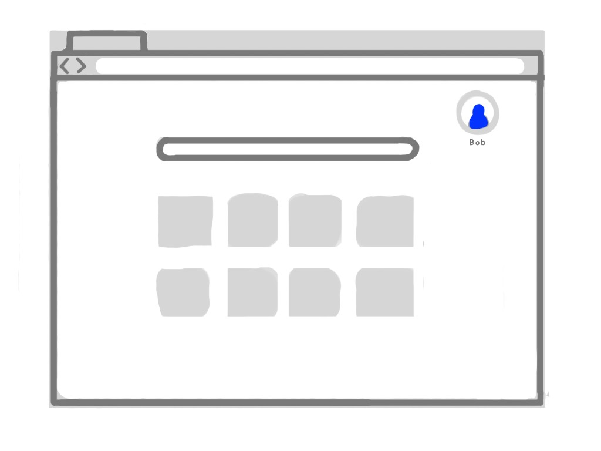
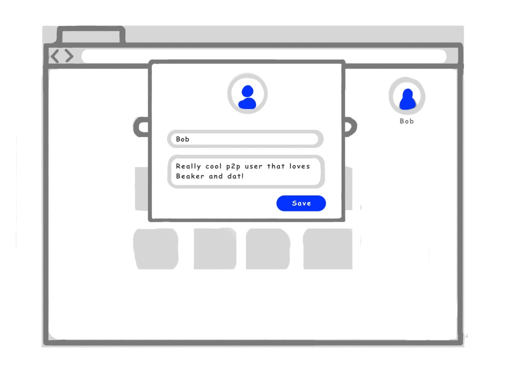
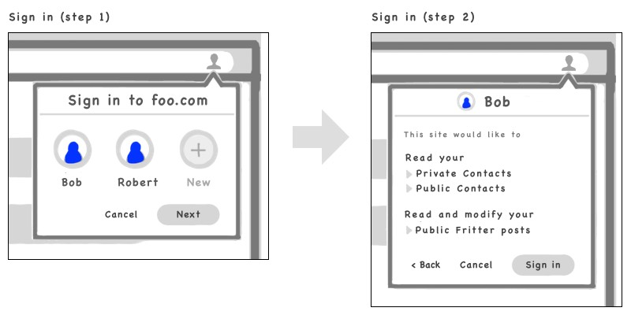
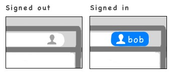
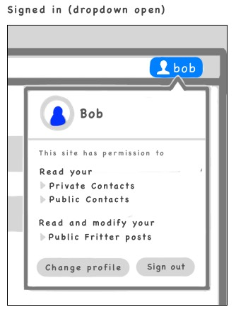
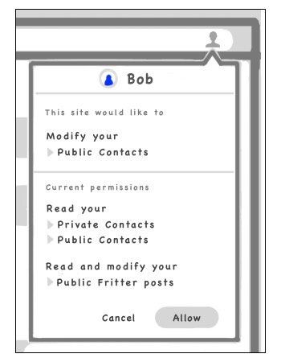

# Beaker User Identities Spec

**Last updated:** Nov 2, 2018

 

The [Beaker Filesystem Spec](./beaker-user-fs.md) establishes core patterns for file storage and permissioning. It specifies a private/public dat architecture for storing application data.

This spec will expand on the public dat as the user's identity and specify the APIs and UI flows for interacting with that identity.

## Overview

Users in Beaker are represented using dats. Beaker uses two dats to accomplish this: a public dat and a private dat. More information about this architecture can be found in the [Beaker Filesystem Spec](./beaker-user-fs.md).

The public dat acts as a public presence (profile) for the user. Its URL is the primary ID of the user. Files written to the public dat are published for the network to consume. Because the public dat is also a website, users can customize their profile dat as a Web presence using HTML, CSS, and JS.

The private dat acts as the personal storage for the user. It is kept off the network and stores data which should not be shared or published.

### Standard public dat information

The public dat includes the following standard information:

|Source|Resource ID|Description|
|-|-|-|
|URL|`public`|The user's global ID.|
|dat.json `title`|`displayName`|The user's display name.|
|dat.json `description`|`bio`|A short user bio.|
|/favicon.(ico\|png)|`favicon`|A square icon that represents the user (ideally 32x32 or 64x64).|
|/thumb.(png\|jpg\|jpeg\|gif)|`thumbnail`|A square image that represents the user (ideally 256x256).|

### Access control

Applications request access to a user's resources using the [`NavigatorSession` API](#navigatorsession-api). A permitted signin provides "basic access" to the following data:

 - The URL of the public dat.
 - The URL of the private dat.
 - Read access to the public dat's files.
 
Write access to the user's dats, plus read access to the private dat, is provided selectively according to the resources requested by the app.

### Main profile

Users can designate a profile to be their "main" profile. This will be the default profile selected in most flows.

### Web presence

The user's public dat also doubles as a personal website. This gives users the opportunity to create a unique presence.

## Flows and user interfaces

### Main profile indicator

The user's main profile is indicated on the start page in the top-right corner. It may be in one of two states:

- **Not created.** A grayed-out user icon is displayed with a label indicating that no profile has been created yet. By clicking on the icon, the user can open a dropdown that prompts the user to create their main profile.
- **Created.** The user avatar picture is displayed with a label containing the display name. By clicking on the icon, the user can open a dropdown that gives a profile overview and links/buttons to edit or visit the profile.



### Edit profile flow

Various interfaces include buttons to edit an existing profile. This opens a modal which provides inputs to edit the display name, bio, and avatar image of the profile. The user may save the changes, cancel/close the modal, or delete the profile.



### Sign in flow

Applications gain access to profiles by "signing in." Signin is triggered by [`NavigatorSession`](#NavigatorSession) usage by the application. This flow takes two steps:

 - **Step 1.** Signin opens a modal with a profile-selector interface. The user may choose from an existing profile, create a new profile, or cancel the flow.
 - **Step 2.** After selecting or creating the profile, the modal switches to the confirmation interface. The confirmation UI shows the permissions which the application is requesting. The user can confirm or go back to the profile selector.



### Current profile session indicator

A site's current session is indicated in the browser UI on the right-hand side of the URL bar. It may be in one of three states:

- **None.** No UI is displayed. This is the default until the application interacts with the [`NavigatorSession`](#NavigatorSession) API.
- **Signed out.** A grayed-out user icon is displayed. By clicking on the icon, the user can open a dropdown which shows that no session is active and which gives a button to trigger signing.
- **Active session.** An "active" user icon is displayed.



By clicking on the icon, the user can open a dropdown which shows the information about the current session's profile. The dropdown includes buttons for changing the profile or for signing out.



### Request additional permissions flow

When additional permissions are requested, a modal appears giving the user a chance to grant the request.



## NavigatorSession API

Overview:

```js
await navigator.session.request([opts])
await navigator.session.destroy()
navigator.session.active // boolean
navigator.session.resources // object
navigator.session.get(resource[, schema]) // => string
navigator.session.getUrl(resource[, schema]) // => Url
navigator.session.addEventListener('changed')
```

Example usage:

```js
// Request full access to the private contacts, public contacts, and public fritter posts
await navigator.session.request({
  resources: [{
    // Private contacts
    type: 'private:objects',
    schema: 'dat://walled.garden/contact.schema.json',
    permissions: ['create', 'read', 'update', 'delete']
  }, {
    // Public contacts
    type: 'public:objects',
    schema: 'dat://walled.garden/contact.schema.json',
    permissions: ['create', 'read', 'update', 'delete']
  }, {
    // Public fritter posts
    type: 'public:objects',
    schema: 'dat://fritter.hashbase.io/schemas/post.json',
    permissions: ['create', 'read', 'update', 'delete']
  }]
})

// Log the user profile info
console.log('Name:', navigator.session.get('displayName'))
console.log('Bio:', navigator.session.get('bio'))
console.log('Avatar:', navigator.session.getUrl('thumbnail'))
console.log('Icon:', navigator.session.getUrl('favicon'))

// List the public contact object-files
var pubContactsUrl = navigator.session.getUrl('public:objects', 'dat://walled.garden/contact.schema.json')
var pubDat = new DatArchive(pubContactsUrl.host)
var pubContactFilenames = await pubDat.readdir(pubContactsUrl.pathname)
```

### navigator.session.request([opts])

A method to request access to a user profile and its resources.

Parameters:

 - `opts` Optional object.
   - `resources` Optional array. Each item is an object with the following attributes:
     - `type` Required string. May be `'private:objects'` or `'public:objects'`.
     - `schema` Required string. The URL of the object-store's schema.
     - `permissions` Optional array of strings. May contain `'read'`, `'create'`, `'update'`, and `'delete'`. Defaults to `['read']`.
     
Returns `Promise<boolean>`.
     
#### navigator.session.request()'s effects

The effects of this method will differ based on the current session state and the parameters.

 - If there is no session, it will start a ["Sign-in" flow](#sign-in-flow).
 - If there is a session and there are more requested resources than the session currently holds, it will start a ["Request Additional Permissions" flow](#request-additional-permissions-flow).
 - If there is a session and there are fewer requested resources than the session currently holds, the session will drop the resources not specified in the call.
 - If there is a session and the requested resources are the same as the session currently holds, there is no effect.
 
The returned promise will be resolved when the signin flow either completes, is canceled, or is closed. The resolve-value and effects will depend on the user action.

 - If the signin flow is completed, the promise will resolve to `true` and the `navigator.session` object will be populated with the new session state.
 - If the signin flow is canceled or closed, the promise will resolve to `false`. The session-request will persist in memory and a visual cue will remain in the URL bar. The user can choose to resume the signin. Subsequent calls to `request()` will update the session-request but will not initiate the signin flow.
 
#### Resources and permissions

The application will be given access to different resources depending on what is requested in the options. By default, a successful sign in will include access to:

 - `'private'` The URL of the private dat.
 - `'public'` The URL of the public dat.
 - `'displayName'` The user's display name.
 - `'bio'` The user's bio line.
 - `'thumbnail'`  The URL of the user's thumbnail image.
 - `'favicon'`  The URL of the user's favicon image.
 
The application can request additional resources with the `resources` parameter of the `request()` call. The two supported resource-types are `'public:objects'` and `'private:objects'`, which represent the public and private [object-store folders](./object-store-folder.md).

The `'public:objects'` and `'private:objects'` resources are parameterized by their schemas. For example, the "Public Contacts Objects" are identified by two strings: `'public:objects'` and `'dat://walled.garden/contact.schema.json'`.

The access provided to private or public objects by the session depends on the permissions specified in the request:

 - `'read'` Can read the files in the objects folder.
 - `'create'` Can create new files in the objects folder.
 - `'update'` Can update existing files in the objects folder.
 - `'delete'` Can delete existing files in the objects folder.
 
For more information on how these resources work, see the [Beaker filesystem spec](./beaker-user-fs.md) and the [Object-store folders spec](./object-store-folder.md).

### navigator.session.destroy()

Ends the session, if active.

Returns `Promise<void>`.

### navigator.session.active

Boolean. Will be `true` if there is an active session or `false` if there is not.

### navigator.session.resources

An array describing the resources available to the session. Matches the structure of the `resources` parameter of [`navigator.session.request()`](#navigatorsessionrequestopts). If the session is not active, this will be an empty array.

### navigator.session.get(resource[, schema])

Get a resource attached to the session.

Parameters:

 - `resource` Required string. The resource's ID.
 - `schema`. Optional string. The schema URL of the resource. Required for `'public:objects'` and `'private:objects'`.

Returns string.

Valid values for `resource` are:

 - `'private'` The URL of the private dat.
 - `'public'` The URL of the public dat.
 - `'displayName'` The user's display name.
 - `'bio'` The user's bio line.
 - `'thumbnail'` The URL of the user's thumbnail image.
 - `'favicon'` The URL of the user's favicon image.
 - `'public:objects'` The URL of a public object-store folder. Requires `schema` to be specified.
 - `'private:objects'` The URL of a private object-store folder. Requires `schema` to be specified.

### navigator.session.getUrl(resource[, schema])

Get the URL of a resource attached to the session. Same as [`navigator.session.get()`](#navigatorsessiongetresource-schema) but returns a `URL` object. Will throw an error on non-url resources such as `'displayName'`.

Parameters:

 - `resource` Required string. The resource's ID.
 - `schema`. Optional string. The schema URL of the resource. Required for `'public:objects'` and `'private:objects'`.

Returns `URL`.

### navigator.session "changed" event

Emitted when the session is created, destroyed, or when granted resource-permissions are changed.

## Examples

### Example login / logout

```js
// setup
render()
navigator.session.addEventListener('changed', e => {
  // rerender when login/logout happens
  render()
})

function render() {
  // main render function
  // we call this function any time the state changes
  yo.update(document.querySelector('main'), yo`
    <main>
      <header>
        ${renderProfile()}
        ${renderLogin()}
      </header>
    </main>
  `)
}

function renderLogin () {
  if (navigator.session.active) return '' // already logged in
  return yo`<div class="login">
    <button onclick=${onClickLogin}>Log in</button>
  </div>`
}

function renderProfile () {
  if (!navigator.session.active) return '' // not logged in
  return yo`<div class="profile">
    
    <span>${navigator.session.get('displayName')}</span>
  </div>`
}

function onClickLogin () {
  // trigger a login attempt
  // (we don't need to await this because we're listening for 'changed')
  navigator.session.request()
}
```
